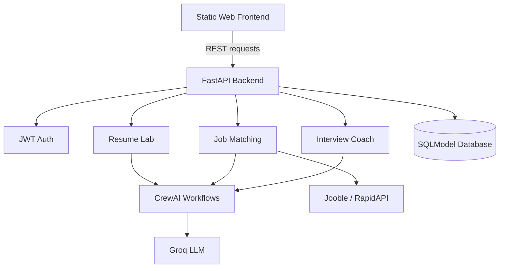
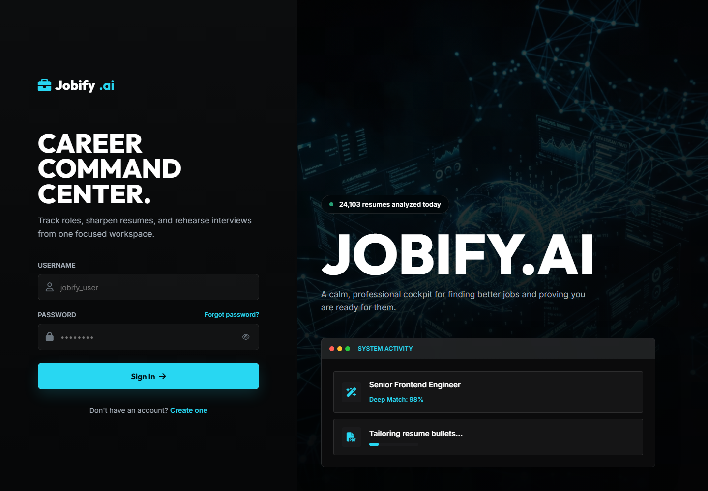
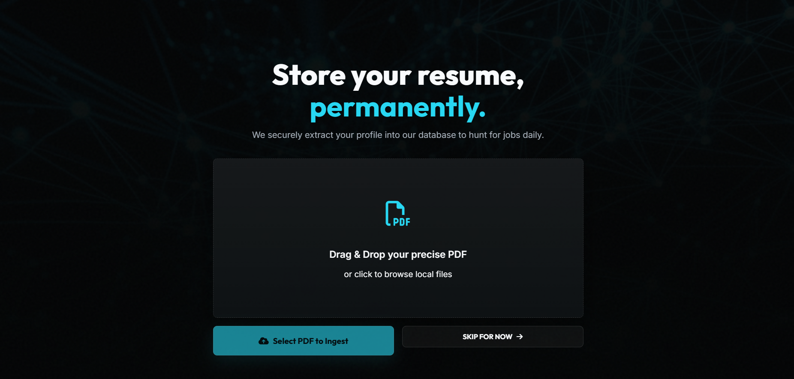
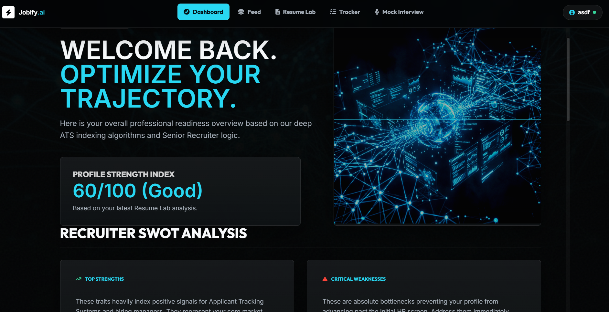
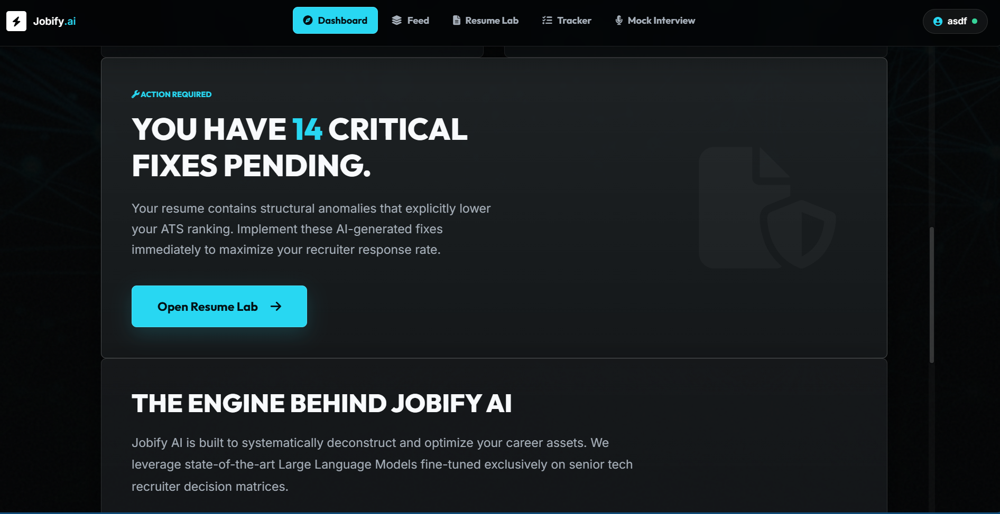
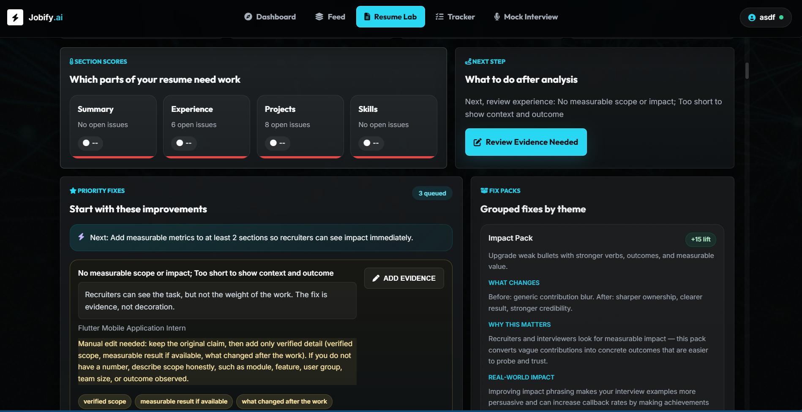
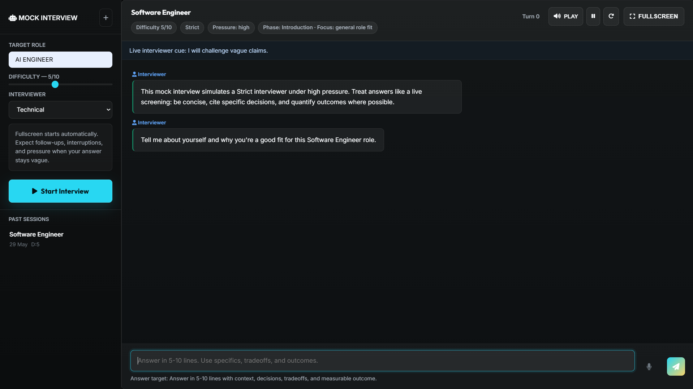

# JobifyAI


---

## Overview

JobifyAI is an AI-powered career assistant that helps candidates analyze resumes, find relevant jobs, improve resume quality, and practice interviews with adaptive AI coaching.

The application combines a FastAPI backend, a static web frontend, SQLModel-based persistence, CrewAI workflows, and Groq-powered language model inference. It is built as a practical full stack AI product with REST APIs, authenticated user flows, resume intelligence, job tracking, and interview preparation.

---

## Why This Project Matters

- Helps candidates understand resume gaps and improve role alignment
- Automates job discovery and resume tailoring for tracked applications
- Provides realistic interview practice with scoring, follow-up questions, and coaching memory
- Demonstrates production-oriented AI engineering with modular routes, database models, and agent workflows
- Shows how LLM workflows can be connected to a usable full stack product

---

## Key Outcomes

- Built an interactive Resume Lab with upload, analysis, rescoring, fixes, manual edits, and download support
- Added AI job feed generation and application tracking with background resume tailoring
- Implemented adaptive mock interview sessions with persisted history and coaching memory
- Created JWT-based authentication with bcrypt password hashing
- Added deployment configuration for Docker, Render, and Vercel static hosting

---

## Features

- PDF resume upload and text extraction
- Resume analysis with section scoring, gap detection, and improvement suggestions
- One-click resume fixes and top-fix application flow
- AI job feed based on resume content and user preferences
- Job tracking with generated tailored resume bullets
- Adaptive mock interview studio with difficulty control and interviewer personas
- Resume-aware interview training based on weak areas
- Career coach memory, score trends, and daily practice plan
- Authenticated API access using JWT bearer tokens
- Static dashboard UI served directly by FastAPI

---

## Tech Stack

| Layer | Technology |
| --- | --- |
| Frontend | HTML, CSS, JavaScript |
| Backend | FastAPI, Uvicorn |
| AI Orchestration | CrewAI |
| LLM API | Groq API |
| Jobs API | Jooble API, RapidAPI fallback |
| Database | SQLModel with SQLite locally and PostgreSQL in production |
| Auth | JWT, bcrypt |
| Resume Parsing | pypdf |
| Deployment | Docker, Render, Vercel |

---

## System Architecture



---

## Workflow Explanation

1. A user registers or logs in through the web interface.
2. The user uploads a PDF resume to the Resume Lab.
3. FastAPI extracts resume text, stores it, and routes analysis tasks to AI workflow helpers.
4. The resume analysis returns scores, section feedback, weak areas, and suggested fixes.
5. The jobs workflow uses resume context and preferences to generate a ranked job feed.
6. Tracked jobs trigger background resume-tailoring tasks.
7. The interview workflow starts adaptive practice sessions using role, difficulty, persona, resume weaknesses, and coaching memory.
8. SQLModel persists users, resumes, job applications, interview sessions, and career coach memory.

---

## API Endpoints

FastAPI docs are available at:

```text
http://127.0.0.1:8000/api/docs
```

| Method | Endpoint | Purpose |
| --- | --- | --- |
| GET | `/api/health` | Service health check |
| POST | `/api/auth/register` | Create user account and return JWT |
| POST | `/api/auth/login` | Log in or migrate legacy user and return JWT |
| POST | `/api/resume/upload` | Upload and parse a PDF resume |
| GET | `/api/resume/lab` | Fetch current Resume Lab state |
| POST | `/api/resume/analyze` | Analyze current resume for a target role |
| POST | `/api/resume/rescore` | Re-score the current resume |
| POST | `/api/resume/fixes/apply` | Apply a selected resume fix |
| POST | `/api/resume/fixes/apply-top` | Apply the highest-priority resume fixes |
| PUT | `/api/resume/text` | Update resume text manually |
| POST | `/api/resume/reset` | Restore the original uploaded resume |
| GET | `/api/resume/download` | Download improved resume text |
| GET | `/api/jobs/feed` | Generate AI job feed for the current user |
| POST | `/api/jobs/track` | Track a job and start resume tailoring |
| GET | `/api/jobs/tracker` | Fetch tracked job applications |
| POST | `/api/interview/start` | Start a general mock interview session |
| POST | `/api/interview/start-from-resume` | Start a resume-aware mock interview |
| POST | `/api/interview/answer` | Submit answer and receive feedback plus next question |
| GET | `/api/interview/coach-memory` | Fetch long-term coaching memory |
| GET | `/api/interview/daily-plan` | Generate daily interview practice plan |
| GET | `/api/interview/modes` | List training modes and interviewer personas |
| GET | `/api/interview/sessions` | List saved interview sessions |
| GET | `/api/interview/sessions/{session_id}` | Fetch a saved interview session |
| DELETE | `/api/interview/sessions/{session_id}` | Delete an interview session |

---

## Project Structure

```text
JobifyAI/
|-- agents/                  # CrewAI agent definitions
|-- data/                    # Local runtime data and CrewAI storage
|-- docs/                    # Deployment and project documentation
|-- src/
|   |-- api/
|   |   |-- routes/          # Auth, resume, jobs, and interview routes
|   |   `-- dependencies.py  # Shared API dependencies
|   |-- core/                # Security and exception handlers
|   |-- database/            # SQLModel engine and migration helpers
|   |-- models/              # Database models
|   |-- config.py            # Environment-based app settings
|   |-- main.py              # FastAPI application entry point
|   `-- resume_lab.py        # Resume analysis and fix logic
|-- static/                  # Frontend HTML, CSS, JS, and images
|-- tasks/                   # CrewAI task definitions
|-- tests/                   # API and Resume Lab tests
|-- utils/                   # Resume parsing, job search, and scoring helpers
|-- app.py                   # Compatibility entry point for uvicorn app:app
|-- crew.py                  # Main AI workflow orchestration helpers
|-- Dockerfile               # Backend container build
|-- render.yaml              # Render deployment config
|-- vercel.json              # Static frontend deployment config
`-- requirements.txt         # Python dependencies
```

---

## Installation

```bash
git clone https://github.com/Advaith4/JobifyAI.git
cd JobifyAI

python -m venv venv
```

Windows:

```powershell
Set-ExecutionPolicy -Scope Process -ExecutionPolicy RemoteSigned
venv\Scripts\activate
pip install -r requirements.txt
```

macOS/Linux:

```bash
source venv/bin/activate
pip install -r requirements.txt
```

---

## Environment Variables

Create a `.env` file in the project root:

```dotenv
GROQ_API_KEY=<your-groq-api-key>
JOOBLE_API_KEY=<your-jooble-api-key>
JOOBLE_API_BASE_URL=https://in.jooble.org/api/{api_key}
RAPIDAPI_KEY=<your-rapidapi-key>
MODEL_NAME=llama-3.1-8b-instant
DATABASE_URL=sqlite:///./jobify.db
SECRET_KEY=<secure-random-secret-key>
AUTO_CREATE_DB_SCHEMA=true
DEBUG=false
```

Notes:

- `DATABASE_URL=sqlite:///./jobify.db` is enough for local development.
- Use PostgreSQL for production deployments.
- `JOOBLE_API_KEY` is the preferred jobs provider key.
- `RAPIDAPI_KEY` is optional and used as a fallback for job search.

---

## Usage

Start the backend and frontend together:

```bash
uvicorn app:app --reload --host 127.0.0.1 --port 8000
```

Open:

```text
http://127.0.0.1:8000
```

API documentation:

```text
http://127.0.0.1:8000/api/docs
```

Alternative local run:

```bash
python app.py
```

---

## Docker Deployment

```bash
docker build -t jobifyai .
docker run --env-file .env -p 8000:8000 jobifyai
```

---

## Production Deployment

This repository includes:

- `render.yaml` for the FastAPI backend and PostgreSQL database on Render
- `vercel.json` for deploying the static frontend from `static/`
- `Dockerfile` for containerized backend deployment

For Render, configure the required API keys as environment variables and deploy from the main branch.

For Vercel, deploy the static frontend and set the backend API origin in your frontend configuration if needed.

---

## Screenshots

### Login and Landing



### Resume Upload



### Dashboard Overview



### Resume Fix Summary



### Resume Lab



### Mock Interview



---

## Demo Video

Add a short walkthrough video showing:

- Login
- Resume upload
- Resume analysis
- Job matching
- Mock interview session

---

## Challenges Solved

- Connected resume analysis, job discovery, and interview coaching into one workflow
- Separated API route logic from reusable AI workflow helpers
- Persisted resume state, interview history, job tracking, and coach memory
- Added background resume tailoring so tracked jobs do not block the API response
- Built local and production database support with lightweight migration helpers

---

## Future Enhancements

- Add recruiter-facing dashboards and candidate comparison views
- Support DOCX resume parsing in addition to PDF
- Add OAuth login and profile management
- Improve analytics for interview progress and job application outcomes
- Add automated email reminders for daily practice plans
- Expand integrations with external ATS and job board APIs

---

## Contribution Guidelines

1. Fork the repository
2. Create a feature branch: `git checkout -b feature/<name>`
3. Commit changes: `git commit -m "Add <feature>"`
4. Push branch: `git push origin feature/<name>`
5. Open a pull request with a clear summary and testing notes

---

## Author

**Advaith G**<br>
AI Engineer & Full Stack Developer

- GitHub: [https://github.com/Advaith4](https://github.com/Advaith4)
- Portfolio: [https://advaith-g.vercel.app](https://advaith-g.vercel.app)

